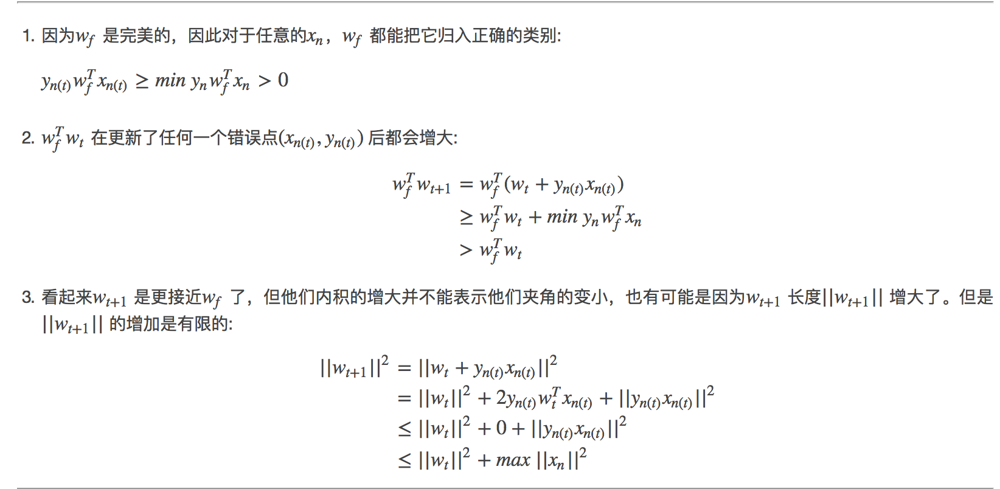
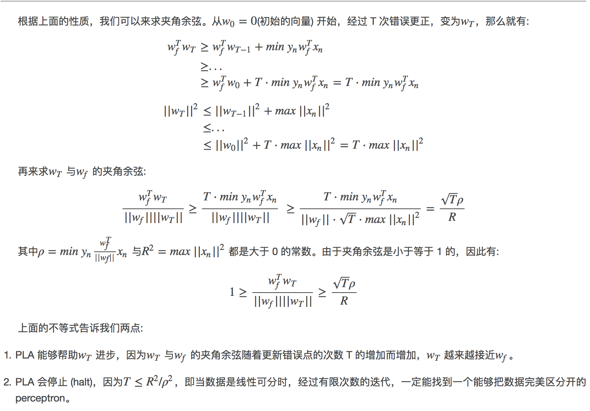

第二课主要讲了知错能改算法：PLA（Perceptron Learning Algorithm），通过每次发现错误都修改一部分的思路不断演算，最终找到需要的目标函数，有张图感觉特别的赞

图片来自：[写给大家看的机器学习书（第二篇）](https://zhuanlan.zhihu.com/p/25439997)

机器学习的架构大致是： *A takes D and H to get g*，也就是说我们会使用演算法来基于资料假设集合计算出一个符合资料呈现结果的方程式g。

## 更新

然后PLC中最重要的一步骤是进行更新怎么做，看图：

图片来自：[林軒田教授機器學習基石 MACHINE LEARNING FOUNDATIONS 第二講學習筆記](http://blog.fukuball.com/lin-xuan-tian-jiao-shou-machine-learning-foundations-di-er-jiang-xue-xi-bi-ji/)

对于上面的图片，我们看更新，当y=1，但是w和x之间夹角却很大，意味着我们要缩小夹角，这个时候w的更新就是加上x向量，如上图所示，当y=-1的时候，同样的思路

## 演算

下一个需要注意的是，怎么保证我们的演算法在更新w过程中是越来越好的，刻画越来越好的方式就是使用余弦角，这个就要一点数学推导了，看：

推导来自：[Perceptron Learning Algorithm (PLA)](http://beader.me/2013/12/21/perceptron-learning-algorithm/)

上面我们知道了随着我们每次更新，w和理想的w之间的夹角是越来越小的，而且迭代次数是有个上限的。

## 非可分

接着是最后一个问题，如果之前我们假设数据是线性可分的，如果我们的数据不可分呢？这个时候我们就退而求其次找到一个分类错误最少的，这几引出了POCKET ALGORITHM，一个贪心的做法，我们每次都将目前认为最好的w攥到手上，然后每次想要更新的时候，都去比较下更新后的是否比手上的好，然后决定是否更换的。

## 代码实战

TODO：初步想法是基于tf来做