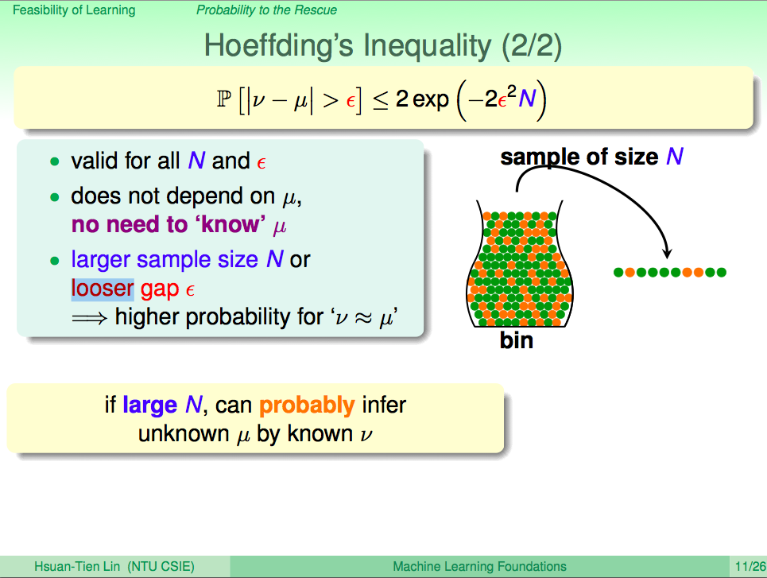
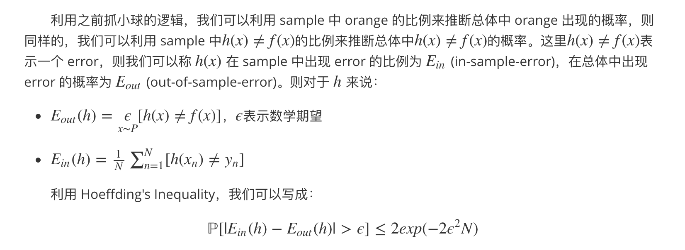

## 机器学习基石第4课笔记

课程的整体设计上是分为：

- When can machines learn?
- Why can machines learn?
- How can machines learn?
- How can machines learn better?

第3课是介绍了机器学习的类型，在哪些场合上使用，本节将会介绍机器的学习可能性（feasibility of learning）

## 为什么讨论学习的可能性？

先看机器学习的基础架构

此处f是我们不知道的，我们希望通过算法A来从数据结合D和假设的H中找到一个接近f的g，而在这个过程中，我们评价g是否好的标准就是看g(xn) 是否和yn相同，即使都相同了，我们有什么根据说g就可以来推断未知的一个x了呢？

## 推断未知的世界 (Inferring Something Unknown)

这就要用到统计里面的一个知识了

其思想就是随机从瓶子中抓取小球，我们通过抓取出来的球的颜色分布从而推断出瓶内的几率分布。

在概率论中，可以用 [Hoeffding's Inequality](http://en.wikipedia.org/wiki/Hoeffding's_inequality) 来描述上面球外分布几率和球内的几率分布的误差.

注：ϵϵ是我们的容忍度，当μμ与νν的差别小于容忍度时，我们称μμ与νν“差不多”(PAC, probably approximately correct)，当μμ与νν差别大于容忍度时，我们称μμ与νν"差很多"。“差很多” 这件事发生的概率越小越好，最大不会超过右边。

## 把 HOEFFDING 不等式和机器学习连接起来

我们将我们的样本认为是抓出来的小球，而学习到的函数g和理想函数f之间的关系抽象为小球颜色

- 如果h(xn)≠f(xn)，即他们判断不一致，我们记第 n 个小球是 orange
- 如果h(xn)=f(xn)， 即他们判断是一致的，我们记第 n 个小球是 green

这样子就给了我们一个能用sample上的正确率来推断在所有数据上的正确率的依据，具体就是：

上面这个只是一个固定的h，但是就像我们之前第2讲中的算法一样，我们会不断的去变化我们的h，直到找到一个好的g，那怎么能保证我们找到的g就是好的呢？

## 不幸的状况 (Bad Data)

这边Bad的含义：我们在我们的抓取到的小球上错误很少，但是在其他数据上错误很多，即:对于任意一个h来说，bad sample 会造成他们的|Ein(h)−Eout(h)|>ϵ，然后对于每个h，都会有bad的情况，那什么的sample数据是好的呢，对于所有的h都是好的sample，那就看下图：

## 加入机器学习基础架构中

通过HOEFFDING 不等式，我们有了数据基础来保证我们学习出来的h是可信的。

## 总结

从概率论的角度出发，可以证明 learning 的确是可行的。因此，只有当Ein(h)和Eout(h)的判断很接近的时候，我们才能说 learning 是可行的。可行之余，倘若Ein(h)很大，这样的 learning 也没有太大意义，因为你的这个h在 sample 中表现不好，则他在 out-of-sample 中表现也不大可能会好。我们把H中表现最好 (Ein最低) 的那个方程选出来，记为g。当然如何定义 “最好”，以及如何去寻找 “最好”，则是后面的内容。

参考：

http://beader.me/mlnotebook/section2/is-learning-feasible.html

[林軒田教授機器學習基石 MACHINE LEARNING FOUNDATIONS 第四講學習筆記](http://blog.fukuball.com/lin-xuan-tian-jiao-shou-ji-qi-xue-xi-ji-shi-machine-learning-foundations-di-si-jiang-xue-xi-bi-ji/)

