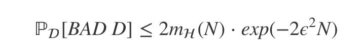
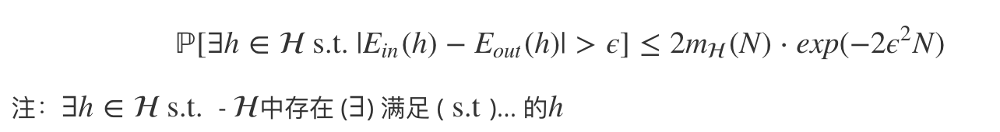
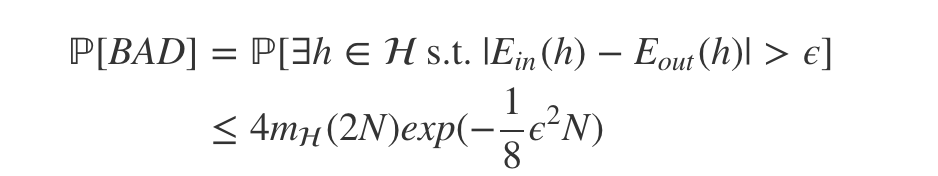
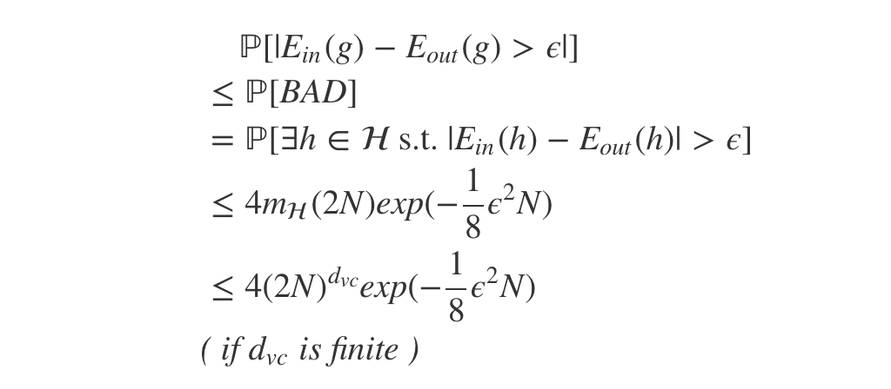

## 机器学习基石第6课笔记

Theory of generalization

----

根据霍夫丁不等式我们已经得到了成长函数的概念mH(N)：在所有可能的h中将(x1,x2,…,xn)最大分类可能的函数，而且我们有了个认识是mH(N)最大是2^N，在此基础上我们又引入了 BREAK POINT 的概念：指下一个输入出现的时候，Dichotomies 组合不再是指数成长的那个点，具体来说就是：

在2维空间中，我们来做perceptron，那么对于N=1，可能的分类是2，N=2^1=2，可能的分类是2^2=4，N=3话，可能的分类是14<2^4=16了，此此时我们就称在2维空间中 BREAK POINT = 4，所以我们就可以得出结论：

如果 H 有 Break Point k，那当 N 大于k 時，mH(N) 成长函数会大大缩减，不再成2^N增长

## BOUNDING FUNCTION

有了Break Point的概念，我们有引入了 BOUNDING FUNCTION 的概念：在N个样本的情况下，如果break point为K，那此时最大可能分类是多少

我们回到之前的2维空间的例子，假设4个点，此时k=4，打破了14 < 2^4=16的增长，此时我们的 BOUNDING FUNCTION 会更进一步，假设 N=4,K=4，此时含义是任意4个点不能被全排列，no shatter，此时 

Bound <= 2^4-1

最后我们经过一系列的推导，我们可以得到Bound function的界限：

最后我们用成长函数来替换霍夫丁不等式后，我们就可以得到 *VAPNIK-CHERVONENKIS（VC）BOUND*

## 总结

Break Point的出现能大大缩小成长函数mH(N)，而mH(N)的上界我们可以用Boundary function B(N, k)来表示，随后我们又推导出了B(N, k) 是一個多項式，接着我们经过一系列的转换能够推导出VAPNIK-CHERVONENKIS（VC）BOUND不等式，但是作用不是很理解？

TODO：作用

首先我们通过PLA能在train set上得到很好的结果，但是可能在test set上却很差，为什么呢？

这就首先引出了霍夫丁不等式，霍夫丁不等式告诉我们发生bad的概率是小于一个常数的，下面是霍夫丁不等式：

ℙ[BAD D]≤2Mexp(−2ϵ2N)

但是上面不等式有个问题，为了让BAD发生的几率小，我们要么希望M小点，但是M小，很难找到Ein(g)较小的g，M如果大的话，找到Ein(g)很小的可能性会大，但是BAD发生的几率会变大，因此我们需要做一点折中。

于是我们就对M进行一些变化，

## H作用于D能够产生多少不同的结果？ (Dichotomies)

effective(N) = H作用于D“**最多**” 能产生多少不同的 dichotomy

通过有效分类的概念，我们将M能够替换为成长函数：

但是此时我们即使知道了成长函数，还是很难去知道各种H的成长函数mH(N)到底长设么样子，这个时候就轮到break point上场 了。

对于上面的式子，更加精确的数学描述是：

但是上面的一个问题是：对于资料外面的误差，Eout(h)是无限多个的，我们要想办法将Eout变成有限个呢？

这就用到了数学上的近似正态分布 (Gaussian)，我们抽取2N笔资料来，其中N笔是train set，另外N笔是test set，这样不等式就变为了：

我们再将成长函数用Bound函数来替换，就 变为了：

这个式子的含义是：

1. H的dvc是有限的，这样 VC Bound 才存在。(good H)
2. N足够大 (对于特定的dvc 而言)，这样才能保证上面不等式的 bound 不会太大。(good D)
3. 算法A有办法在H中顺利地挑选一个使得Ein最小的方程g。(good A)

为什么要费那么大的力气来讲这个 VC Bound 和 VC Dimension 呢？因为对于初学者来说，最常犯的错误就是只考虑到了第 3 点，而忽略掉了前两点，往往能在 training set 上得到极好的表现，但是在 test set 中表现却很烂。