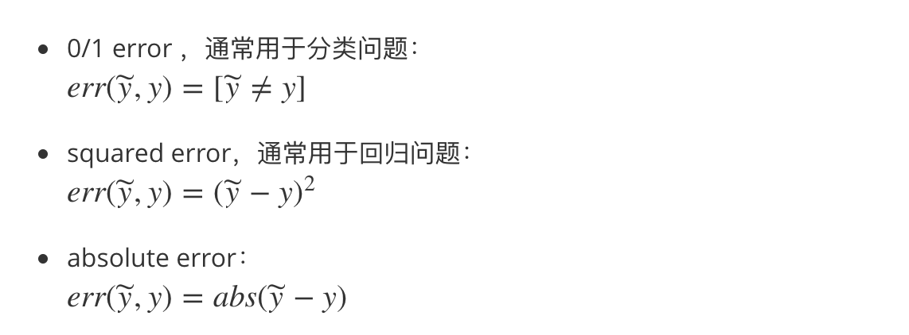

## 机器学习基石第8讲

本讲主要内容是noise，先回忆一下机器学习的基础架构：

此处对于资料集D的一个假设是：y都是由目标函数f(x)产生的，但是如果有噪声呢？即y的值和f(x)的值不一样呢？这怎么办？

对于某个样本 x，理想状态下，应该有y=f(x)=+1，但由于某种 noise 的存在，该 noise 会有 30% 的概率会转换f(x)f(x)的结果 (把 + 1 变成 - 1 或把 - 1 变成 + 1)。因此在D中，该样本有 70% 的概率表现出y=+1，30% 的概率表现出y=−1

此时机器学习的基础架构变为了：

# 误差的衡量 (Error Measure)

常见的衡量方式

此时机器学习的基础架构变为了：

实际中err的衡量都是业务相关的，有时候连业务本身都不知道衡量的方式，此时我们的演算法只能根据实际情况自己调整错误衡量，此时机器学习框架变为了：

